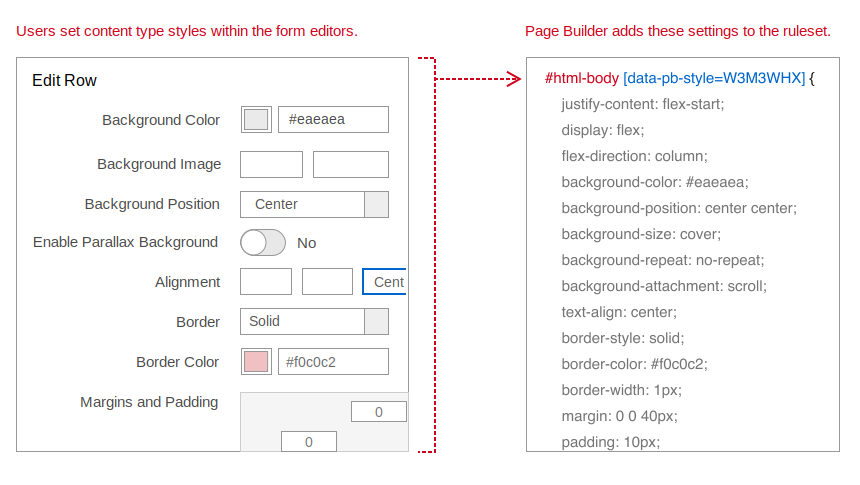
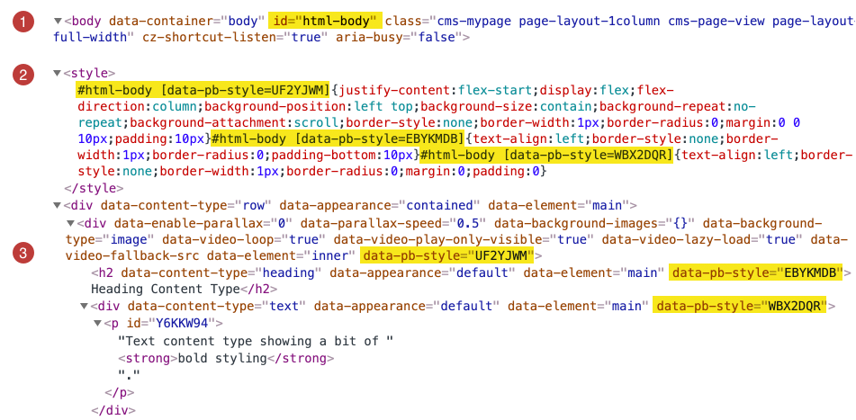

# How Page Builder styles content

To style both its native content types and your custom content types, Page Builder does the following:

-  Creates a single, dynamic CSS ruleset for each content type.

-  Populates the ruleset with default values and values from the end user's chosen settings in the content type's editor.

-  Creates a CSS selector for the ruleset by combining the page's `html-body` id with the `data-pb-style` attribute and unique (dynamically generated) value. The unique value ensures that each content type on the page can be uniquely targeted.

## Page Builder CSS example
For example, Page Builder generates the following CSS ruleset for the default settings on a Row content type:

```css
#html-body [data-pb-style=WMWMCFQ] {
    justify-content: flex-start;
    display: flex;
    flex-direction: column;
    background-position: left top;
    background-size: cover;
    background-repeat: no-repeat;
    background-attachment: scroll;
    border-style: none;
    border-width: 1px;
    border-radius: 0;
    margin: 0 0 10px;
    padding: 10px;
}
````

As end users change and save settings within a content type's editor, Page Builder updates the CSS ruleset to reflect those changes (and creates a new unique value for `data-pb-style`).



## Inspecting Page Builder CSS

If you inspect a page on your storefront built with Page Builder, you can see for yourself how Page Builder applies styles to its content types. For example, the following HTML is from a simple page with three content types: a Row, Heading, and Text. The highlighted parts show how the styles are defined and applied to Page Builder content types on a page.



1. **Html-body id**. The first thing to notice is the CSS `id=html-body` assigned to Magento storefront pages. Page Builder uses this `id` to construct all the CSS selectors it applies to its content types.

2. **Internal style block**. Page Builder adds all the unique `data-pb-style` attribute styles (one for each content type on the page) to a single `<style>` block. This creates what's called an internal stylesheet for the page. In this example, the page contains three content types. So Page Builder has added three CSS rulesets to the `<style>` block, one for each content type on the page. If the page contained 10 content types, the `<style>` block would contain 10 CSS rulesets.

3. **Applied styles**. The dynamic `data-pb-style` attributes on the content types match their respective CSS styles in the `<style>` block, and the browser does the rest. For custom content types (and many native content types), Page Builder applies the `data-pb-style` attribute to the top-level container element. However, for some content types, like the Row shown in this example, the `data-pb-style` attribute is added to an inner element.

## Page Builder CSS specificity

Page Builder generates `id` + `attribute` selectors to dynamically create a CSS ruleset for a content type. The pattern for each content type is always the same, one `id` selector and one attribute selector. This gives all Page Builder content types a specificity of **110**.


The CSS specificity of 110 is relatively low, which makes it possible to override these styles with your own custom CSS. For more information on CSS specificity and how it works, see https://developer.mozilla.org/en-US/docs/Web/CSS/Specificity.

## Overriding Page Builder CSS

To customize or override a Page Builder style assigned to a content type, we recommend creating a CSS selector that targets the content type with using a custom class, as follows:

-  `html-body` id
-  `data-content-type` attribute
-  your custom CSS class

For example, if you wanted to override the Heading content type, the selector for your CSS class should follow this pattern:


This CSS selector results in a CSS specificity value of 120, which overrides the 110 specificity for Page Builder styles, while keeping the specificity relatively low for any additional overrides, as needed.

In addition, you need to add your CSS class (or classes) to the content type. You can do this by adding your class names to the content type's **CSS Classes** field in the editor. For this example, you would add `theme-headings` to the field in the Headings editor, as shown:


## Summary

Page Builder applies styles to native and custom content types by creating dynamic, attribute-based styles, using a CSS selector pattern that results in a specificity of 110 for each content type style. These styles are added to a single internal stylesheet for each page and can be easily overridden with custom CSS classes.

See [How to add custom CSS to Page Builder](how-to-add-custom-styles.md) to start customizing styles for existing Page Builder content types.
