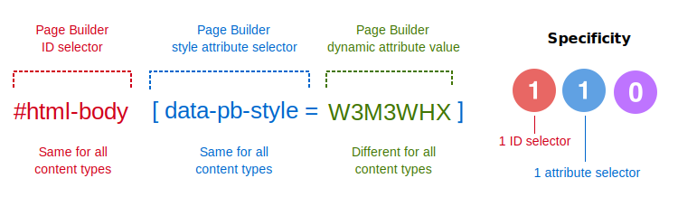
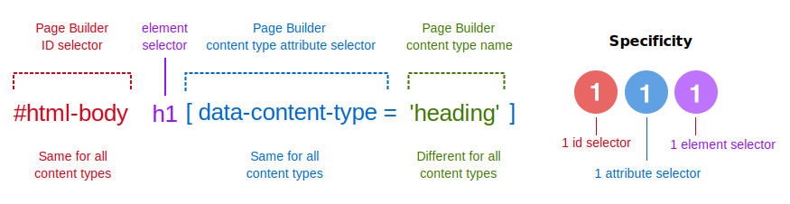

# How to override Page Builder styles

To override the internal CSS Page Builder applies to content types, you must create a CSS selector with a [specificity](https://developer.mozilla.org/en-US/docs/Web/CSS/Specificity) greater than 110, which is Page Builder's default selector specificity for all native and custom content types, as shown here:


_Page Builder default style selectors_

To learn the details of how Page Builder styles its content types, see [How Page Builder styles content](how-pagebuilder-styles-content.md).

## CSS selector override pattern

To help you with overriding Page Builder styles, we recommend the following CSS selector pattern: `#html-body` + `[attribute]` + `any additional selector`, as shown here:


_Page Builder override selector pattern_

1. `#html-body` - Start all your override selectors with this `id`. It's in the `<body>` element of all Magento frontend and admin pages.

1. `[data-content-type='my-custom']` - Add a content-type attribute selector next, where the `'my-custom'` is the name of the content type found in its configuration file. For example, to target the `Row` content type, your attribute selector would look like `[data-content-type='row']`.

1. `Any additional selector` - The first two selectors match Page Builder's internal selectors with a specificity of 110. Adding any other selector (except `*`) will bump the specificity to 111 or higher, which overrides Page Builder's internal selector.

## CSS selector override example

For example, if you wanted to override the CSS that Page Builder applies to the `Heading` content type, you could use a selector pattern that targets one of the `Heading` HTML elements (like `h1`),which would create a CSS specificity of 111, as shown here:

```scss
#html-body h1[data-content-type="heading"] {}
```



With one additional HTML element selector, you can override Page Builder's default style while keeping the specificity low for additional overrides, as needed.

## More selector override examples

In the following examples, each selector targets a different HTML element of a content type, but all of them have a specificity higher than Page Builder's default of 110:

**Override all `Heading` styles**

```scss
#html-body [data-content-type="heading"][data-element="main"]  {} // Specificity 120
```

**Override all `Heading` styles for `default` appearance**

```scss
#html-body [data-content-type="heading"][data-appearance="default"] {} // Specificity 120
```

**Override all `Row` inner element styles**

```scss
#html-body [data-content-type="row"] [data-element="inner"] {} // Specificity 120
```

**Override all `Text` typography styles**

```scss
#html-body [data-content-type="text"] p {} // Specificity 111
```

## Override content using CSS Classes

So far, we've only used IDs, attributes, and elements to override Page Builder's CSS. But you can also use CSS classes to fill the `any additional selector` slot of the pattern. To override a content type using one or more custom CSS classes:

1. Create the CSS selector.

2. Apply the CSS class.

### Step 1: Create the CSS selector

If your CSS class name is `.theme-headings`, the CSS selector you define in your `.less` file would look something like this:

```scss
#html-body [data-content-type="heading"].theme-headings {}
```


By adding the class to the pattern, you create a `Heading` selector with a specificity of 120—which again overrides Page Builder's default specificity of 110. All the CSS rules declared in this class selector will override Page Builder's equivalent rules for the `Heading` content type.

### Step 2: Apply the CSS class

The second step is to add your custom class name to the content type's form editor, specifically to the **CSS Classes** field.

For example, to have Page Builder apply the `theme-headings` class to a `Heading` on the page, you would open the `Heading` form editor and enter `theme-headings` (no period) in the **CSS Classes** field, as shown here:


Page Builder adds this class to the `Heading` element (`h1` - `h6`) in the DOM, where it is targeted and styled by your CSS class selector and ruleset.

## Where to override Page Builder CSS

Now that you understand Page Builder's CSS selector override pattern, as well as how to apply class names to existing Page Builder content types, it's time to put your knowledge to use.

The next three topics describe how and where you can override Page Builder's default styles:

-  [Use Themes to override styles](use-themes-to-override-styles.md)
-  [Use Modules to override styles](use-modules-to-override-styles.md)
-  [Use HTML Code to override styles](use-htmlcode-to-override-styles.md)
