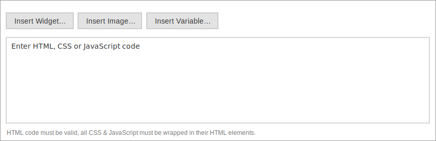

# Override Page Builder styles using HTML Code

{:.bs-callout-info}
The `HTML Code` content type can only override frontend theme and module styles. Admin styles cannot be overridden with this content type.

To quickly develop and test custom CSS overrides for the storefront (before moving them to your modules and themes):

1. Drag an `HTML Code` content type anywhere on the stage. Its position on the stage does not matter. Styles added to `HTML Code` will always be placed _after_ Page Builder's internal `<style>` block. This placement ensures that your `HTML Code` block styles will override Page Builder's styles.

1. Open the form editor for the content type.

   

1. Add your overriding CSS styles to a `<style>` block in the WYSIWYG editor.

   

    ```html
    <style>
    #html-body [data-content-type='heading'].my-class {
      display: flex;
      justify-content: center;
      align-items: center;
      color: red;
      margin: 40px;
    }
    </style>
    ```

Using `HTML Code` in this way creates an internal stylesheet (on the page) that overrides any same-specificity CSS defined in the external stylesheets of your themes and modules. This can be handy when you want to test changes for existing frontend theme and module styles without having to recompile `.less` files.
