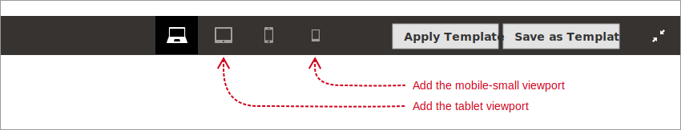
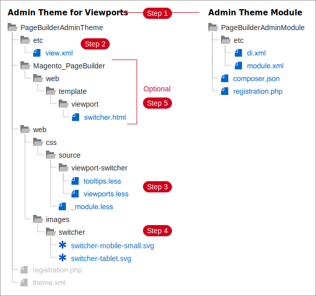

# How to add viewports

By default, Page Builder defines four viewports, but only two are shown on the Admin stage: `desktop` and `mobile`. The other two viewports (hidden from the stage), are `tablet` and `small-mobile`. This topic shows you how to add the hidden viewports to the stage and customize them as needed.



{: .bs-callout-info }
**Example available**. A fully functioning example for adding additional viewports is available for you to view and install here: [https://github.com/magento-devdocs/pagebuilder-viewports/tree/how-to-add-viewports](https://github.com/magento-devdocs/pagebuilder-viewports/tree/how-to-add-viewports). This example is implemented as an Admin theme for Page Builder, an approach we recommend for all viewport additions and customizations.

## Steps for adding viewports

1. [Create an Admin theme](#step-1-create-an-admin-theme).
1. [Add a view.xml file](#step-2-add-a-viewxml-file). This file should contain your configuration data for the additional viewports.
1. [Add viewport CSS classes](#step-3-add-viewport-css-classes). These classes control the stage canvas width for a selected viewport.
1. [Add viewport button images](#step-4-add-viewport-button-images). These are SVG images for the viewport buttons.
1. [Add Switcher template](#step-5-customize-switchhtml-template-optional) (Strictly optional). If you want to customize the tooltip content, you can copy and paste Page Builder's `switcher.html` template to your Admin theme, then make changes to the template as needed.

{: .bs-callout-info }
Unlike the `view.xml` configuration (which merges with Page Builder's `view.xml` configuration), a custom `switcher.html` template completely overrides Page Builder's `switcher.html` template. This means you may need to update your theme's `switcher.html` with any new template features or bindings introduced in future Page Builder versions of the `switcher.html` template to ensure that nothing breaks.

### Step 1: Create an Admin theme

To create and apply an Admin theme, follow the instructions described here:

-  [Create an Admin theme]({{ site.baseurl }}/guides/v2.4/frontend-dev-guide/themes/admin_theme_create.html).
-  [Apply an Admin theme]({{ site.baseurl }}/guides/v2.4/frontend-dev-guide/themes/admin_theme_apply.html).

Your Admin theme and module should have directory structure similar to the following diagram:



### Step 2: Add a `view.xml` file

As with other XML files in Magento, you can add to and override the existing viewport configurations by adding a `view.xml` file to your Admin theme. In our example theme, we added button icons and additional properties to Page Builder's existing, but hidden, viewports: `table` and `mobile-small`.

```xml
<?xml version="1.0"?>
<view xmlns:xsi="http://www.w3.org/2001/XMLSchema-instance" xsi:noNamespaceSchemaLocation="urn:magento:framework:Config/etc/view.xsd">
    <vars module="Magento_PageBuilder">
        <var name="breakpoints">
            <var name="tablet">
                <var name="label">Tablet</var>
                <var name="stage">true</var>
                <var name="default">false</var>
                <var name="class">mobile-switcher</var>
                <var name="icon">images/switcher/switcher-tablet.svg</var>
                <var name="media">only screen and (max-width: 1024px)</var>
            </var>
            <var name="mobile-small">
                <var name="label">Mobile Small</var>
                <var name="stage">true</var>
                <var name="class">mobile-switcher</var>
                <var name="icon">images/switcher/switcher-mobile-small.svg</var>
                <var name="media">only screen and (max-width: 540px)</var>
                <var name="conditions">
                    <var name="max-width">540px</var>
                </var>
            </var>
        </var>
    </vars>
</view>
```

You can add as many viewports to the `view.xml` configuration as you want.
For example, if you wanted a viewport with a `max-width` of `300px`, you could create one called `mobile-tiny` and set its properties as follows:

```xml
<var name="breakpoints">
    ...
    <var name="mobile-tiny">
        <var name="label">Mobile Tiny</var>
        <var name="stage">true</var>
        <var name="class">mobile-switcher</var>
        <var name="icon">images/switcher/switcher-mobile-tiny.svg</var>
        <var name="media">only screen and (max-width: 300px)</var>
        <var name="conditions">
            <var name="max-width">300px</var>
        </var>
    </var>
    ...
```

For more information about the viewport configuration properties, see the [view.xml topic](pagebuilder-viewports.md#viewxml).
### Step 3: Add viewport CSS Classes

Page Builder uses viewport-specific CSS classes to change the stage's canvas width for the selected viewport.
So when you add a viewport configuration to the `view.xml` file, you need to add a corresponding CSS class to your `viewports.less` file in your theme.
Your CSS class must use the following naming convention:

```terminal
 <viewport-name>-viewport
 ```

The `<viewport-name>` should be replaced with the name of the viewport defined in your `view.xml` file.

 In our Admin theme example, we added two CSS classes to set the stage's canvas width for the `tablet` and `mobile-small` viewports:

```scss
.tablet-viewport {
    &.pagebuilder-stage-wrapper {
        &.stage-content-snapshot,
        &.stage-full-screen {
            .pagebuilder-stage {
                .pagebuilder-canvas {
                    left: 50%;
                    transform: translateX(-50%);
                    max-width: 1024px;
                }
            }
        }
    }
}

.mobile-small-viewport {
    &.pagebuilder-stage-wrapper {
        &.stage-content-snapshot,
        &.stage-full-screen {
            .pagebuilder-stage {
                .pagebuilder-canvas {
                    left: 50%;
                    transform: translateX(-50%);
                    max-width: 540px;
                }
            }
        }
    }
}
```

When a user clicks a viewport button, Page Builder assigns the viewport's matching CSS class to the `viewportClasses` observable, which changes the stage canvas width.

- The `max-width` property sets the width of the stage canvas, where content is displayed on the screen.
- The`left` and `transform` properties center the canvas on the stage.

Here's another example. The following CSS class would control the stage canvas width for the `mobile-tiny` viewport we saw in Step 2 above:

```scss
.mobile-tiny-viewport {
    &.pagebuilder-stage-wrapper {
        &.stage-content-snapshot,
        &.stage-full-screen {
            .pagebuilder-stage {
                .pagebuilder-canvas {
                    left: 50%;
                    transform: translateX(-50%);
                    max-width: 300px;
                }
            }
        }
    }
}
```

The `max-width` defined in the CSS class should match the `max-width` defined for the viewport configuration in the `view.xml` file. Matching widths ensures that the stage view matches the storefront view.

### Step 4: Add viewport button images

Page Builder uses SVG images for its existing viewport button icons. And while you _can_ use other image formats (like .png), we recommend creating SVG icons that match Page Builder's existing icons.

To match Page Builder's icons, create your icons with the following properties:

- height: 18px height.
- width: 20px, or narrower as needed.
- background: transparent.
- fill: #fff.

The source button icons used in the example Admin theme are shown here:


Giving all icons a height of 18px ensures they align nicely within Page Builder's stage header.

### Step 5: Customize `switch.html` template (optional)

As mentioned previously, if you want to change the viewport button's tooltip description based on the selected viewport, you need to add your own `switcher.html` template that replaces Page Builder's `switcher.html`. The template shown here adds some dynamic word swapping when different viewports are displayed:

```html
<each args="data: Object.keys(viewports), as: 'name'">
    <span class="tooltip">
        <button type="button"
                class="page-builder-viewport"
                css="$parent.viewports[name].class"
                disable="name === $parent.viewport()"
                click="$parent.toggleViewport.bind($parent, name)">
            
        </button>
        <span class="tooltip-content">
            <span class="tooltip-label" translate="$parent.viewports[name].label"/><br/>
            <span translate="'Display your content for '"/><text args="name"/><br/>
            <span if="name !== 'desktop'" translate="'Width'"/>
            <span if="name === 'desktop'" translate="'Minimum Width'"/>:
            <text args="Object.values($parent.viewports[name].conditions)[0]"/>
        </span>
    </span>
</each>
```

This template shows two trivial changes to Page Builder's `switcher.html` template:

- **Line 12**—We changed one word of the text description.
- **Lines 13-14**— We added Knockout conditional `span` tags to display different tooltip content ("Width" vs. "Minimum Width") based on the selected viewport (`desktop` vs. others).

Your changes can be simple, like this, or as complex as required.
## Summary

In this topic you learned how to add more viewports to Page Builder's stage so that end users can preview how their content will look a different widths on the storefront. To learn more about how to use these viewports to customize your content types, see [How to use viewports](how-to-use-viewports.md).
