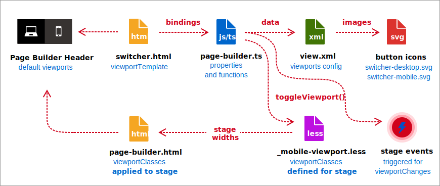
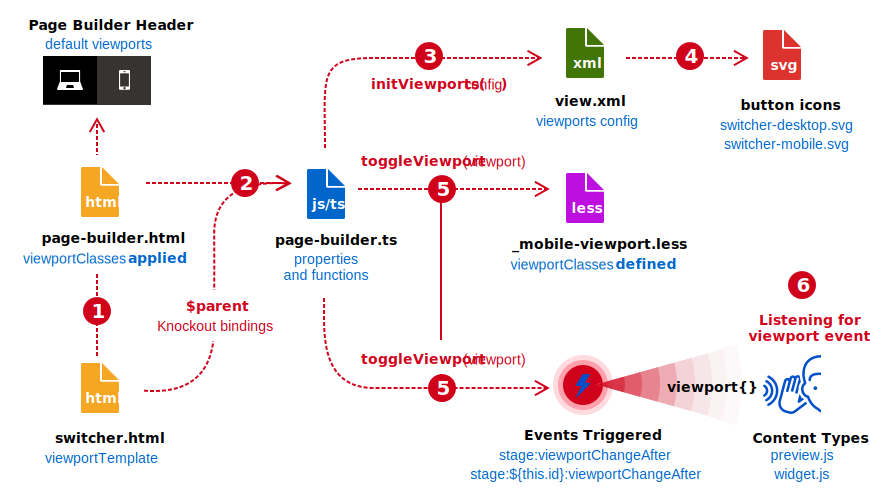

# Page Builder viewports

Page Builder provides previews of your content at different device widths called _viewports_. In Page Builder's full-screen design mode, buttons for switching viewports appear in the header above the stage. By default, Page Builder provides two viewports: **desktop** and **mobile**, as shown here:


Clicking these viewport buttons changes the width of the stage to show previews of how page content (content types) on the storefront will look on different devices. For example, the default `mobile` viewport narrows the stage to 768px, as shown here:


## Viewport files

The viewport files listed below provide the HTML templates, functions, properties, configuration data, and events associated with Page Builder viewports.

{: .bs-callout-info }
To access the linked source code for each file listed here, you must have access to the private Page Builder repository: `magento/magento2-page-builder`.

- [Magento/PageBuilder/etc/view.xml](https://github.com/magento/magento2-page-builder/blob/develop/app/code/Magento/PageBuilder/etc/view.xml)
- [Magento/PageBuilder/view/adminhtml/web/template/page-builder.html](https://github.com/magento/magento2-page-builder/blob/develop/app/code/Magento/PageBuilder/view/adminhtml/web/template/page-builder.html)
- [Magento/PageBuilder/view/adminhtml/web/template/viewport/switcher.html](https://github.com/magento/magento2-page-builder/blob/develop/app/code/Magento/PageBuilder/view/adminhtml/web/template/viewport/switcher.html)
- [Magento/PageBuilder/view/adminhtml/web/ts/js/page-builder.ts](https://github.com/magento/magento2-page-builder/blob/develop/app/code/Magento/PageBuilder/view/adminhtml/web/ts/js/page-builder.ts)
- [Magento/PageBuilder/view/adminhtml/web/css/source/_mobile-viewport.less](https://github.com/magento/magento2-page-builder/blob/develop/app/code/Magento/PageBuilder/view/adminhtml/web/css/source/_mobile-viewport.less)
- [Magento/PageBuilder/view/adminhtml/web/css/images/switcher/switcher-desktop.svg](https://github.com/magento/magento2-page-builder/blob/develop/app/code/Magento/PageBuilder/view/adminhtml/web/css/images/switcher/switcher-desktop.svg)
- [Magento/PageBuilder/view/adminhtml/web/css/images/switcher/switcher-mobile.svg](https://github.com/magento/magento2-page-builder/blob/develop/app/code/Magento/PageBuilder/view/adminhtml/web/css/images/switcher/switcher-mobile.svg)

The following diagram shows what these files contribute to the features and functions of viewports, followed by summary descriptions.



-  [page-builder.html](#page-builderhtml)—Template parent that hosts Page Builder's header, viewport buttons, template buttons, panel, and stage.
-  [switcher.html](#switcherhtml)—Template (`viewportTemplate`) that defines the viewport buttons using Knockout bindings for the `toggleViewport()` function, button images, and tooltips.
-  [page-builder.ts](#page-builderts)—ViewModel that defines the viewport properties and functions for the `switcher.html` template bindings.
-  [view.xml](#viewxml)—Configuration data that defines properties for viewport names, visibility, defaults, min- and max-widths, button icons, tooltip labels, and more.
-  [_mobile_viewport.less](#_mobile-viewportless)—Defines CSS classes that control the stage width. Classes in this file are assigned to the observable `viewportClasses` property and switched when `toggleViewport()` is triggered by the viewport buttons.
-  [Button icons](#button-icons)—SVG images for the viewport buttons.
-  [Stage events](#stage-events)—The events triggered from the `toggleViewport()` function—[`stage:viewportChangeAfter`](../reference/events.md#stageviewportchangeafter) and [`stage:${this.id}:viewportChangeAfter`](../reference/events.md#stageidviewportchangeafter). Content type JavaScript components (`preview.ts` and `widget.js`) can listen for these events and make responsive changes as needed.

## Viewport bindings and events

The following diagram is similar to the previous diagram, but focuses on the relationships and interactions between the viewport files. The numbers are not meant to show a sequence. They simply call out the important connections between the files.



1. **Templates**—The `page-builder.html` template renders the `switcher.html` viewport template in the header section of the Page Builder stage.
1. **Bindings**—The `switcher.html` binds to the properties and functions in its parent's ViewModel: `page-builder.ts`.
1. **Initialization**—The `page-builder.ts` ViewModel initializes its properties from the `view.xml` viewport data config file and sets the default viewport.
1. **Button icons**—The button icons are referenced by URLs in the `view.xml` file.
1. **Toggle function**—The `toggleViewport()` function is bound to the button click event in the `switcher.html` template. This function does two things:

   -  Sets the `viewportClasses` observable to a CSS class defined by the selected viewport.
   -  Triggers the `stage:viewportChangeAfter` events for listeners.

1. **Events**—Content types handle the viewport events within their `widget.js` and `preview.ts` files.

The following sections provide details about each of the files described in the previous diagrams.

## `page-builder.html`

The `page-builder.html` template hosts the `switcher.html` template (`viewportTemplate`) in the Page Builder's header:

```html
<!-- page-builder.html -->

<div class="admin__field pagebuilder-header"...>
    <span class="viewport-buttons">
        <render args="viewportTemplate"/> <!-- switcher.html -->
    </span>
    ...
</div>
```

The `page-builder.html` template also includes the `viewportClasses` observable. When this observable changes, the stage width changes to match the `max-width` defined in the viewport's CSS class.

```html
<!-- page-builder.html -->

<div class="pagebuilder-stage-wrapper"
     css="Object.assign({'stage-full-screen': isFullScreen, 'stage-content-snapshot': isSnapshot},
     viewportClasses)"
```

For more information about `viewportClasses`, see [Viewport properties](#viewport-properties) and [_mobile-viewports.less](#_mobile-viewportless), later in this topic.

## `switcher.html`

The `switcher.html` file is the template for the viewport buttons. Page Builder uses this template to render the button for each viewport defined in the `view.xml` file. This template includes Knockout bindings to its parent's ViewModel, `page-builder.js`, as shown here:

```html
<!-- switcher.html -->

<each args="data: Object.keys(viewports), as: 'name'">
    <span class="tooltip">
        <button type="button"
                class="page-builder-viewport"
                css="$parent.viewports[name].class"
                disable="name === $parent.viewport()"
                click="$parent.toggleViewport.bind($parent, name)">
            
        </button>
        <span class="tooltip-content">
            <span class="tooltip-label" translate="$parent.viewports[name].label"/><br/>
            <span translate="'View your content for '"/><text args="name"/><br/>
            <span translate="'Width'"/>: <text args="Object.values($parent.viewports[name].conditions)[0]"/>
        </span>
    </span>
</each>
```

Notice how the `switcher.html` template uses dot syntax to access viewport data from the `page-builder.ts` ViewModel. This syntax corresponds to the data hierarchy in the `view.xml` configuration. For example, the `` and the `tooltip-label` are bound as follows:

```html
<!-- switcher.html -->


<span class="tooltip-label" translate="$parent.viewports[name].label"/>
```

These bindings map to the `icon` and `label` nodes of the viewport data defined in the `view.xml` file, starting with the viewport name, as shown here:

```xml
<!-- view.xml -->

<var name="desktop">
    <var name="label">Desktop</var>
    <var name="icon">Magento_PageBuilder::css/images/switcher/switcher-desktop.svg</var>
</var>

<var name="mobile">
    <var name="label">Mobile</var>
    <var name="icon">Magento_PageBuilder::css/images/switcher/switcher-mobile.svg</var>
</var>
```

## `page-builder.ts`

As previously noted, Page Builder's `page-builder.ts` file is the `$parent` ViewModel for the `switcher.html` template. The ViewModel includes the viewport properties (initialized in `initViewports()`) and functions bound to the `switcher.html` template. Details about these properties and functions are described next.

### Viewport properties

**`viewports`**—Object array that contains all the viewports (and their properties) defined in the `view.xml` config file. These properties include viewport names, visibility, defaults, min- and max-widths, button icons, tooltip labels, and more. See [view.xml](#viewxml) for details.

**`viewport`**-`KnockoutObservable<string>` that provides the currently selected viewport by name: `desktop` or `mobile` by default.

**`defaultViewport`**—Name (`string`) of the viewport that is selected by default. This property is set in the `view.xml` configuration.

**`viewportClasses`**—Observable object array of CSS classes used to change the stage width for the currently selected viewport. The `toggleViewport()` assigns CSS classes to the`viewportClasses` observable based on the selected viewport. The function uses the selected viewport name appended with `'-viewport'` to assign the correct CSS class. By default, Page Builder uses only one CSS class to set the stage width for its `mobile` viewport: `mobile-viewport`. The `desktop` viewport does not have a class because it does not set a stage width that is different from the stage's default width. See [_mobile-viewport.less](#_mobile-viewportless) and [Add viewport CSS classes](#step-3-add-viewport-css-classes) for more information.

### Viewport functions

**`initViewports(config)`**—Sets the viewport property values from the `view.xml` config file. The `switcher.html` template (the `viewportTemplate`) binds to these properties as previously described. This function also sets the default viewport for the stage. You can set the default viewport in the `view.xml` file as described below.

**`toggleViewport(viewport)`**—Assigns CSS classes to the `viewportClasses` observable, based on the selected viewport name passed in as an argument (`viewport`). The CSS classes in `viewportClasses` set the stage width. This function also triggers the `stage:viewportChangeAfter` events so that content types can handle these events and make changes to their own layouts. For more details, see [Stage events](#stage-events) at the end of this topic.

## `view.xml`

Page Builder's `view.xml` file provides the default configuration data for the `desktop` and `mobile` viewports, as shown here:

```xml
<!-- view.xml -->

<vars module="Magento_PageBuilder">
    <var name="breakpoints">
        <var name="desktop">
            <var name="label">Desktop</var>
            <var name="stage">true</var>
            <var name="default">true</var>
            <var name="class">desktop-switcher</var>
            <var name="icon">Magento_PageBuilder::css/images/switcher/switcher-desktop.svg</var>
            <var name="conditions">
                <var name="min-width">1024px</var>
            </var>
            <var name="options">
                <var name="products">
                    <var name="default">
                        <var name="slidesToShow">5</var>
                    </var>
                </var>
            </var>
        </var>
        <var name="mobile">
            <var name="label">Mobile</var>
            <var name="stage">true</var>
            <var name="default">false</var>
            <var name="class">mobile-switcher</var>
            <var name="icon">Magento_PageBuilder::css/images/switcher/switcher-mobile.svg</var>
            <var name="media">only screen and (max-width: 768px)</var>
            <var name="conditions">
                <var name="max-width">768px</var>
                <var name="min-width">640px</var>
            </var>
            <var name="options">
                <var name="products">
                    <var name="default">
                        <var name="slidesToShow">3</var>
                    </var>
                </var>
            </var>
        </var>
    </var>
</var>
```

Descriptions of each node follows:

- `Magento_PageBuilder` - Defines the module to which viewport data applies.
- `breakpoints` - Defines `viewports` object for the module.
- `desktop` and `mobile` - Defines viewport objects named `desktop` and `mobile`.
- `label` - (string) Defines title of tooltip.
- `stage` - (bool) Determines whether viewport button appears above the stage.
- `default` - (bool) Determines if the viewport is selected when the stage is loaded.
- `class` - (string) CSS class to apply to the viewport switcher button (not the stage).
- `icon` - (string) - URL to the button image (SVG) location.
- `media` - (string) Media query used in the Admin.
- `conditions` - Defines the `min` and `max` breakpoints for the viewport.
- `max-width` - (string) Defines the maximum width for the viewport in `px`.
- `min-width` - (string) Defines the minimum width for the viewport in `px`.
- `options` - Viewport data defined for the `Products` content type. You can define similar nodes with unique names for your own content types.
- `products` - Viewport data defined for the `Products` content type. You can define similar nodes with unique names for your own content types.
- `default` - Viewport data defined for the `default` appearance of the `Products` content type. You can define similar nodes with unique names for your own content types.
- `slidesToShow` - Viewport data to set the `slidesToShow` variables within the `preview.js` and `widget.js` components of the `Products` content type. You can define similar data with unique names for your own content types.

As shown for the `Products` content type, you can define your own viewport data hierarchy to fit your needs. For example, if you have a custom content type called `testimonials`— which showed customer quotes similar to how the `Products` carousel works — you could create a new node in the `mobile` viewport called `viewport-data` node, as shown here:

```xml
<!-- view.xml -->

<var name="mobile">
   ...
    <var name="viewport-data">
        <var name="testimonials">
            <var name="default">
                <var name="testimonialsToShow">3</var>
            </var>
            <var name="with-images">
                <var name="testimonialsToShow">2</var>
            </var>
        </var>
    </var>
</var>
```

In short, whenever you need viewport-specific data to make responsive changes from your `preview.js` and `widget.js` components, you can define your own data structures in the `view.xml` file. To learn more about defining and using viewport data, see [Create responsive JavaScript](how-to-use-viewports.md#create-responsive-javascript) in [How to use viewports](how-to-use-viewports.md).

## `_mobile-viewport.less`

The `_mobile-viewport.less` file includes the CSS class for Page Builder's `mobile` viewport. As mentioned in [Viewport properties](#viewport-properties) above, this class is assigned to the `viewportClasses` observable after the mobile viewport button is clicked, at which point the stage width changes to the width defined by the `.mobile-viewport` class, which follows the strict naming convention:

```css
.[viewport-name]-viewport
```

The `[viewport-name]` refers to the name of the viewport as defined in the `view.xml` file. For example, a viewport with the name of `mobile-small` requires a CSS class named `.mobile-small-viewport`. If your CSS classes names don't follow this convention, the `toggleViewport()` function won't assign the correct CSS class to `viewportClasses` for the stage. The code that determines this convention is shown here:

```javascript
// page-builder.ts

public toggleViewport(viewport: string) {
    ...
    this.viewportClasses[`${viewport}-viewport`](true);
    ...
}
```

Page Builder's default `.mobile-viewport` class shows the hierarchy of CSS selectors needed to target the `pagebuilder-canvas`, the part of the stage that displays the content:

```scss
// _mobile-viewport.less

.mobile-viewport {
    &.pagebuilder-stage-wrapper {
        &.stage-content-snapshot,
        &.stage-full-screen {
            .pagebuilder-stage {
                .pagebuilder-canvas {
                    left: 50%;
                    transform: translateX(-50%);
                    width: 768px;
                }
            }
        }
    }
}
```

## Button icons

Page Builder's viewport button icons use SVG images. The URLs to these images are included in the `view.xml` file for each viewport (`desktop` and `mobile`), as shown in these snippets:

```xml
<!-- view.xml -->

<var name="desktop">
    <var name="icon">Magento_PageBuilder::css/images/switcher/switcher-desktop.svg</var>
</var>

<var name="mobile">
    <var name="icon">Magento_PageBuilder::css/images/switcher/switcher-mobile.svg</var>
</var>
```

As the URLs indicate, Page Builder's SVG images for the buttons are located here:


## Stage events

Page Builder triggers the stage events from the `toggleViewport()` function, which is bound to the viewport button in the `switcher.html` template. After the viewport button is clicked, the `toggleViewport()` function is executed and the stage events are triggered.

```typescript
// page-builder.ts

public toggleViewport(viewport: string) {
    ...
    events.trigger(`stage:${this.id}:viewportChangeAfter`, {
        viewport,
        previousViewport,
    });
    events.trigger(`stage:viewportChangeAfter`, {
        viewport,
        previousViewport,
    });
}
```

Page Builder's content types (and your custom content types) can handle these events and make responsive changes based on the current `viewport` or `previousViewport` names passed with the events. To learn more about how to use viewport stage events, see [Create responsive JavaScript](how-to-use-viewports.md#create-responsive-javascript).

## Summary

Understanding what viewports are and how they work in Page Builder is the first step. The next two steps include [How to add viewports](how-to-add-viewports.md) to Page Builder and [How to use viewports](how-to-use-viewports.md) to create responsive content types.
